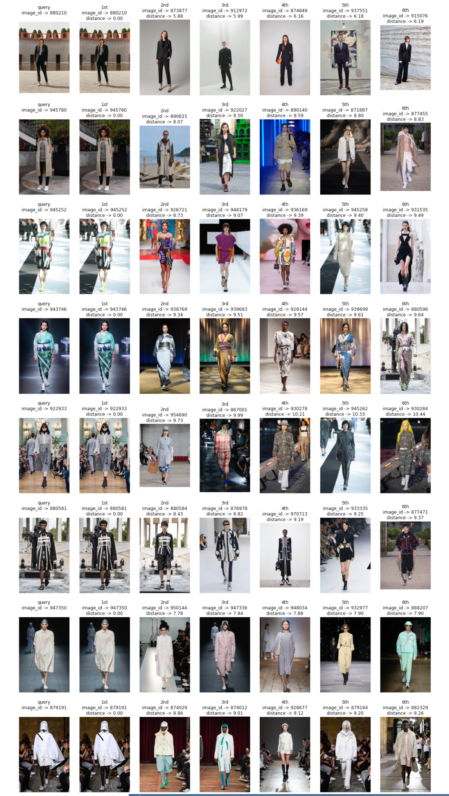
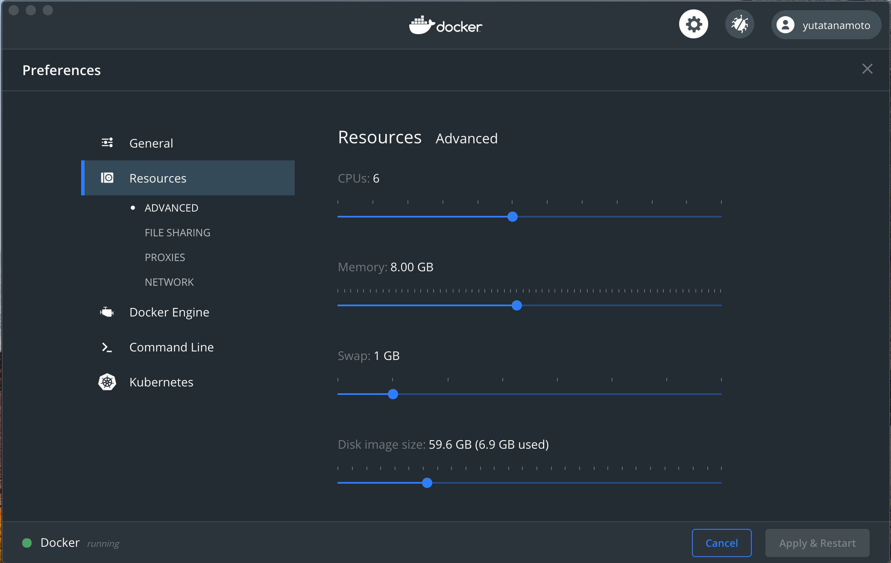

# Runway Retriever  
Sample code for similar runway image retrieval  


## Requirement  
- docker  
- docker-compose  
- docker's 'Resources:Momory' >= 8GB


## Usage  
#### Clone this repository  
```
$ git clone https://github.com/YUTATanamoto/similar-runway-image-retrieval-sample.git  
```
#### Start container
```
$ cd similar-runway-image-retrieval-sample  
$ docker-compose up
```
- Above command will launch 'jupyter notebook'  
- Open url begining with 'http://127.0.0.1:8888' displayed on the terminal  
- Open notebooks/deeplab-efficientnet-annoy.ipynb  

#### Stop and delete container
```
$ docker-compose down --rmi all --volumes
```

## TODO
- Create feature extractor using VAE
