# 機械学習モデルによる画像特徴量抽出と近似最近傍探索を用いた類似画像検索 

## References
#### Basics  
- [Similar Images Recommendations using FastAi and Annoy](https://towardsdatascience.com/similar-images-recommendations-using-fastai-and-annoy-16d6ceb3b809)
- [Content Based Image Retrieval Using a Convolutional Denoising Autoencoder](https://medium.com/sicara/keras-tutorial-content-based-image-retrieval-convolutional-denoising-autoencoder-dc91450cc511)  

#### Advanced
- [Baseにおける類似画像検索](https://logmi.jp/tech/articles/322876)
- [Yahooにおける類似画像検索](https://techblog.yahoo.co.jp/entry/2020081130014621/)

## Overview  
- There are two main xxx, image feature extraction using pretrained deep-learning model and approximate nearest neighbors.
- Use two pretrained deep-learning model, '[DeeplabV3](https://github.com/tensorflow/models/tree/master/research/deeplab)' and '[EfficientNet](https://arxiv.org/pdf/1905.11946.pdf)' to extract image feature.
- Use python package by Spotify, named '[annoy](https://github.com/spotify/annoy)' for approximate nearest neighbors.

# 1. Indexing

##### Import modules


```python
import os
import sys
import glob
import numpy as np
from PIL import Image
from tqdm import tqdm
import tensorflow as tf
import tensorflow_hub as hub
from annoy import AnnoyIndex
import matplotlib.pyplot as plt
sys.path.append(os.path.abspath('..'))
from libs.deeplabv3.model import Deeplabv3
```

### 1.1. Extract features (vector embeddings)  from images using pretrained ML model

##### Define feature-extractor


```python
class FeatureExtractor(tf.keras.Model):
    def __init__(self):
        super(FeatureExtractor, self).__init__()
        self.deeplab = Deeplabv3()
        self.deeplab_person_region_index = 15
        efficientnet_intermediate_layer_url = "https://tfhub.dev/google/efficientnet/b0/feature-vector/1"
        self.efficientnet_input_shape = [224,224,3]
        self.efficientnet_intermediate_layer = hub.KerasLayer(
            efficientnet_intermediate_layer_url,
            input_shape=self.efficientnet_input_shape)

    def call(self, images, training=False):
        deeplab_outputs = self.deeplab(images)
        person_region_masks = tf.cast(tf.math.argmax(deeplab_outputs, -1) == self.deeplab_person_region_index, tf.float32)
        masked_images = images * tf.stack([person_region_masks, person_region_masks, person_region_masks], axis=3)
        resized_and_masked_images = tf.image.resize(masked_images, self.efficientnet_input_shape[:2])
        self.image_features = self.efficientnet_intermediate_layer(resized_and_masked_images)
        return self.image_features
    
```

##### Create input pipeline 


```python
def load_and_preprocess_image(image_path):
    '''preprocess image to feed feature-extractor with appropriate input'''
    target_image_shape=[512, 512]
    num_channels = 3
    raw_image = tf.io.read_file(image_path)
    image_tensor = tf.image.decode_jpeg(raw_image, channels=num_channels)
    resized_image_tensor = tf.image.resize(image_tensor, target_image_shape)
    resized_and_normalized_image_tensor = resized_image_tensor/255.0
    return resized_and_normalized_image_tensor

AUTOTUNE = tf.data.experimental.AUTOTUNE
image_dir = "/Volumes/Samsung_T5/19MH228/similar-image-retrieval/images/images_season_id_22"
image_path_list = glob.glob(image_dir + '/*.jpg')[::100]
num_images = len(image_path_list)
image_ids = np.array([int(os.path.splitext(os.path.basename(image_path))[0]) for image_path in image_path_list])
batch_size = 1
image_path_dataset = tf.data.Dataset.from_tensor_slices(image_path_list)
image_dataset = image_path_dataset.map(load_and_preprocess_image, num_parallel_calls=AUTOTUNE).batch(batch_size)
```

##### Extract image features from images


```python
feature_extractor = FeatureExtractor()
image_features = feature_extractor.predict(image_dataset, verbose=1)
```

    239/239 [==============================] - 78s 326ms/step


##### Save ids and features


```python
feature_save_dir = '../extracted-features'
if not os.path.isdir(feature_save_dir):
    os.mkdir(feature_save_dir)
image_ids_save_path = '../extracted-features/image-ids.npy'
image_features_save_path = '../extracted-features/image-features.npy'
np.save(image_ids_save_path, image_ids)
np.save(image_features_save_path, image_features)
```

### 1.2. Build index

##### Build annoy model


```python
image_ids_save_path = '../extracted-features/image-ids.npy'
image_features_save_path = '../extracted-features/image-features.npy'
image_ids = np.load(image_ids_save_path)
image_features = np.load(image_features_save_path)
image_vector_dims = image_features.shape[1]
num_trees = 50
metric = 'euclidean'
annoy_model = AnnoyIndex(image_vector_dims, metric)
for image_id, image_vector in tqdm(zip(image_ids, image_features)):
    annoy_model.add_item(image_id, image_vector)
annoy_model.build(num_trees)
```

    239it [00:03, 73.09it/s]


    True


##### Save index model


```python
model_save_dir = '../models'
if not os.path.isdir(model_save_dir):
    os.mkdir(model_save_dir)
annoy_model_save_path = "../models/{}-{}-{}.ann".format(image_vector_dims, metric, num_trees)
annoy_model.save(annoy_model_save_path)
```


    True


<br>

# 2. Retrieval

### Evaluate 

##### Check avairable annoy models


```python
model_save_dir = '../models'
print('Avairable annoy models -> {}'.format(glob.glob(model_save_dir+'/*.ann')))
```

    Avairable annoy models -> ['../models/1280-euclidean-50.ann']


##### Test similar image retrieval


```python
annoy_model_path = '../models/1280-euclidean-50.ann'
metric = os.path.basename(annoy_model_path).split('-')[1]
num_feature_dims = int(os.path.basename(annoy_model_path).split('-')[0])
annoy_model = AnnoyIndex(num_feature_dims, metric)
annoy_model.load(annoy_model_path)
ext = ".jpg"
image_id_and_arrays = []
for query_image_path in tqdm(glob.glob(image_dir + "/*"+ext)[::900]):
    num_neighbors = 5
    query_image_id = int(os.path.splitext(os.path.basename(query_image_path))[0])
    nearest_neigbor_ids, distances = annoy_model.get_nns_by_item(
        query_image_id, 
        num_neighbors, 
        search_k=-1,
        include_distances=True
    )
    query_image = Image.open(query_image_path)
    query_image_array = np.array(query_image)
    fig = plt.figure(figsize=(40, 20))
    ax = fig.add_subplot(1, num_neighbors+1, 1)
    ax.imshow(query_image_array)
    ax.set_title('query\nimage_id -> {}\n'.format(query_image_id))
    ax.axis("off")
    for i, (neigbor_image_id, distance) in enumerate(zip(nearest_neigbor_ids, distances)):
        image_file = os.path.join(image_dir, str(neigbor_image_id)+ext)
        image = Image.open(image_file)
        image_array = np.array(image)
        ax = fig.add_subplot(1, num_neighbors+1, i+2)
        ax.imshow(image_array)
        rank_statement = "1st" if i == 0 else "2nd" if i == 1 else "3rd" if i == 2 else "{}th".format(i+1)
        ax.set_title('{}\nimage_id -> {}\ndistance -> {}'.format(rank_statement, neigbor_image_id, distance))
        ax.axis("off")
    plt.show()
```

      0%|          | 0/27 [00:00<?, ?it/s]


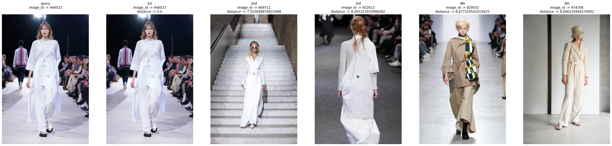


      4%|▎         | 1/27 [00:01<00:44,  1.71s/it]


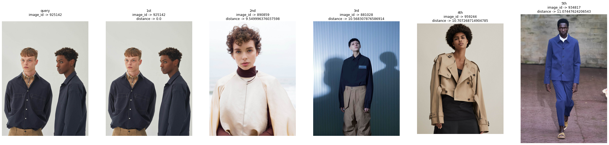


      7%|▋         | 2/27 [00:03<00:42,  1.71s/it]


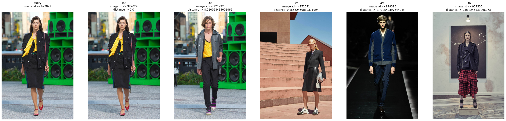


     11%|█         | 3/27 [00:05<00:40,  1.70s/it]


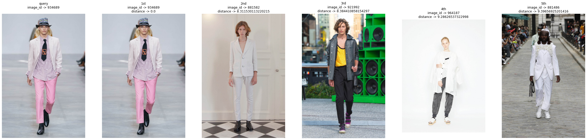


     15%|█▍        | 4/27 [00:06<00:38,  1.68s/it]


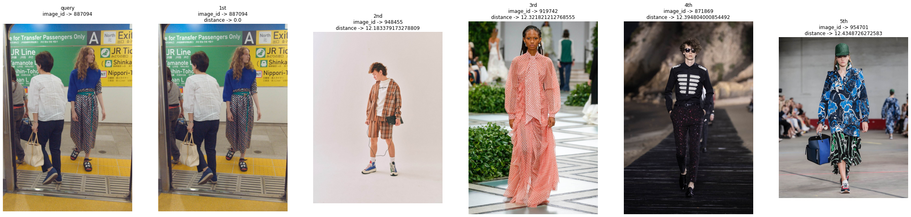


     19%|█▊        | 5/27 [00:08<00:37,  1.68s/it]


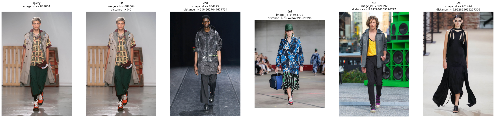


     22%|██▏       | 6/27 [00:10<00:35,  1.67s/it]


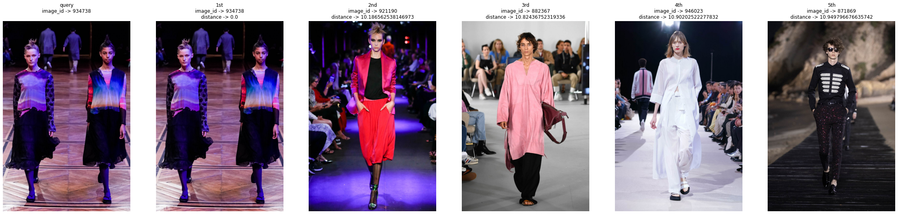


     26%|██▌       | 7/27 [00:11<00:33,  1.67s/it]


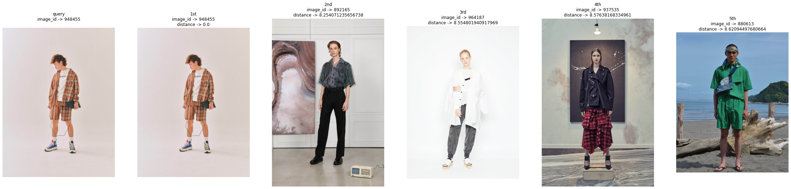


     30%|██▉       | 8/27 [00:13<00:31,  1.65s/it]


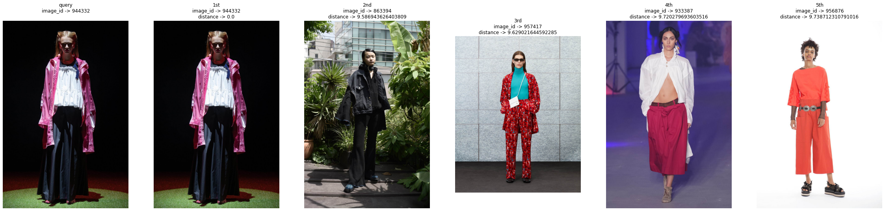


     33%|███▎      | 9/27 [00:15<00:29,  1.66s/it]


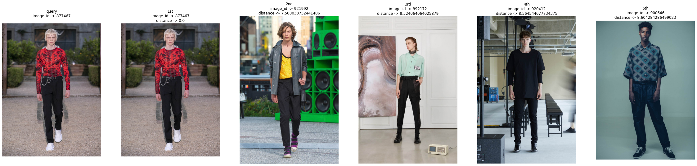


     37%|███▋      | 10/27 [00:16<00:28,  1.66s/it]


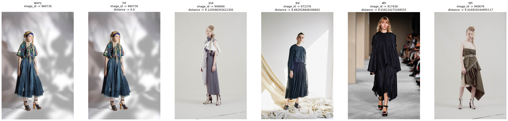


     41%|████      | 11/27 [00:18<00:25,  1.62s/it]


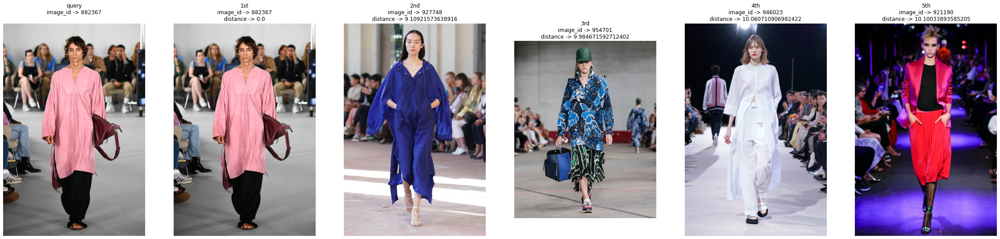


     44%|████▍     | 12/27 [00:19<00:24,  1.64s/it]


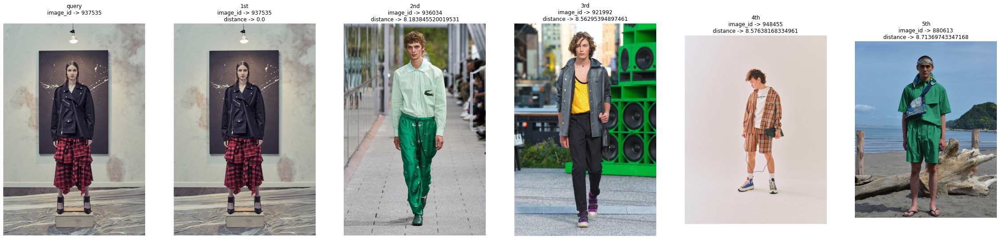


     48%|████▊     | 13/27 [00:21<00:23,  1.65s/it]


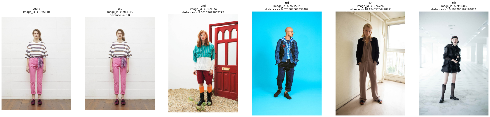


     52%|█████▏    | 14/27 [00:23<00:21,  1.62s/it]


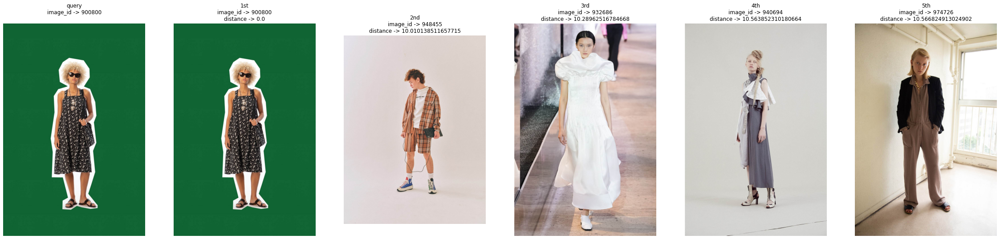


     56%|█████▌    | 15/27 [00:24<00:19,  1.60s/it]


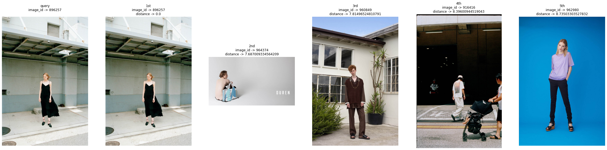


     59%|█████▉    | 16/27 [00:26<00:19,  1.74s/it]


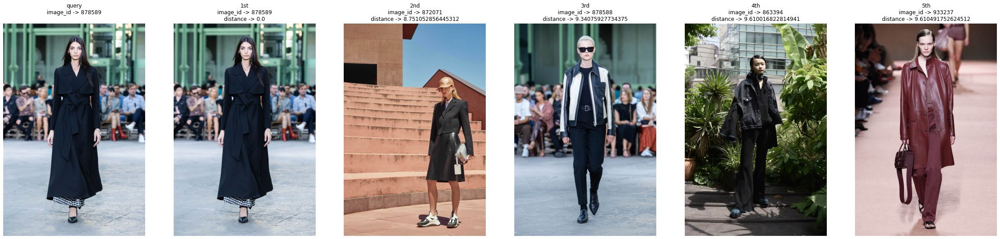


     63%|██████▎   | 17/27 [00:28<00:17,  1.73s/it]


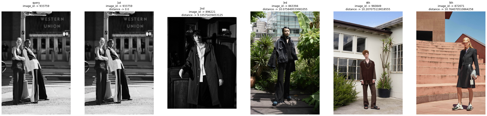


     67%|██████▋   | 18/27 [00:30<00:15,  1.69s/it]


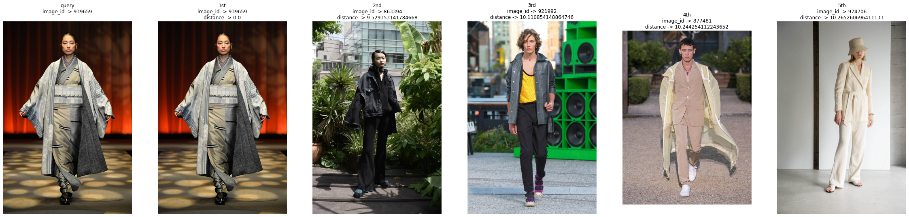


     70%|███████   | 19/27 [00:31<00:13,  1.70s/it]


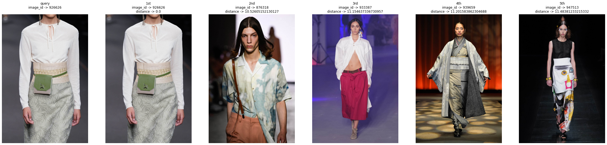


     74%|███████▍  | 20/27 [00:33<00:11,  1.67s/it]


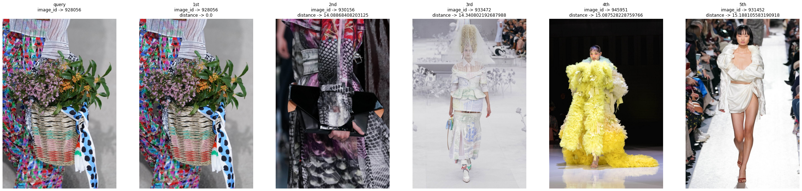


     78%|███████▊  | 21/27 [00:34<00:09,  1.65s/it]


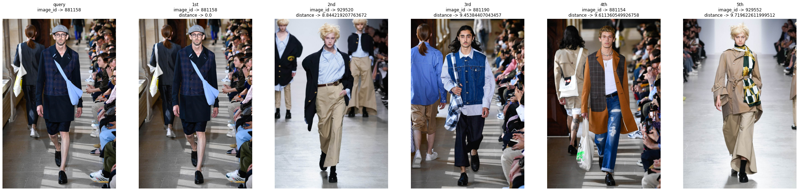


     81%|████████▏ | 22/27 [00:36<00:08,  1.66s/it]


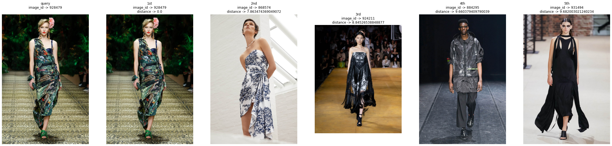


     85%|████████▌ | 23/27 [00:38<00:06,  1.71s/it]


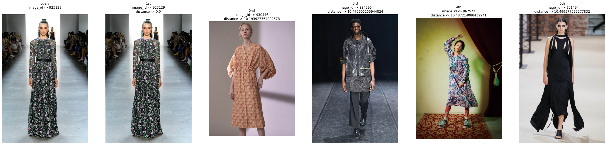


     89%|████████▉ | 24/27 [00:40<00:05,  1.69s/it]


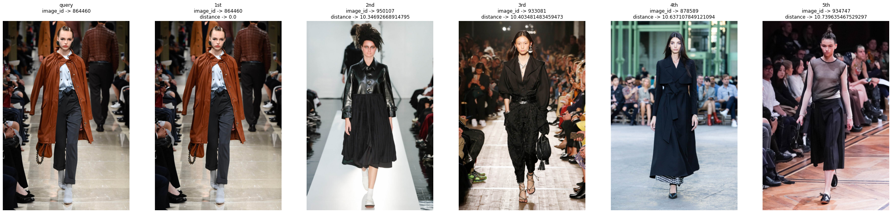


     93%|█████████▎| 25/27 [00:41<00:03,  1.68s/it]


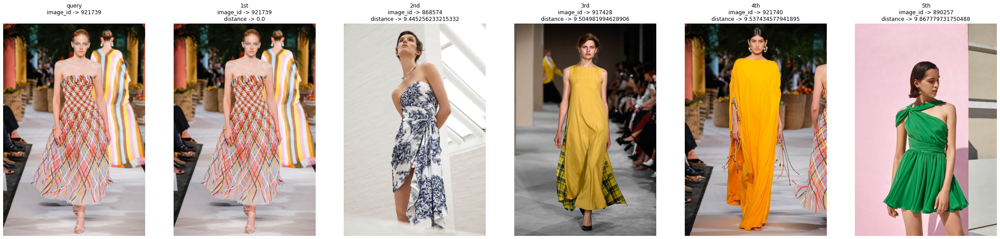


     96%|█████████▋| 26/27 [00:43<00:01,  1.67s/it]


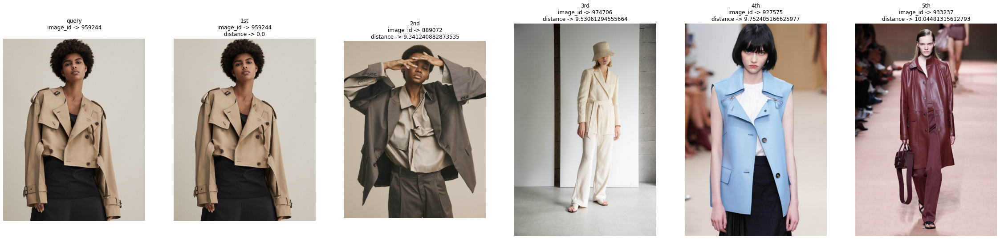


    100%|██████████| 27/27 [00:45<00:00,  1.67s/it]


```python

```
